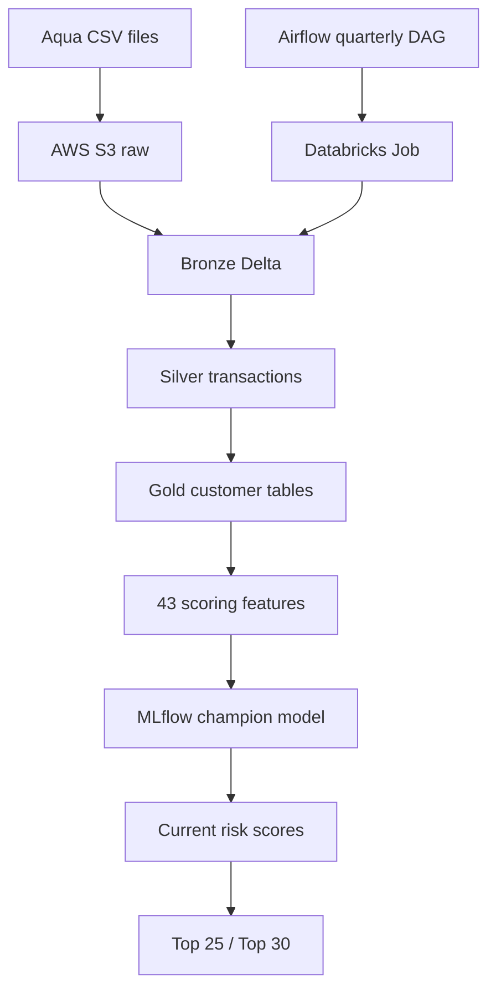

# Customer Intelligence ML Lakehouse

Production-oriented customer churn early-warning system built with AWS S3, Apache Spark, Databricks, MLflow, Unity Catalog and Apache Airflow.

The system identifies currently active customers who are at risk of suffering a revenue decline of at least 30% during the following three months. It produces a complete customer risk table plus operational Top 25 and Top 30 retention lists.

## Project status

The churn workflow is implemented and validated end to end.

| Capability | Status |
| --- | --- |
| Incremental Bronze, Silver and Gold pipeline | Complete |
| Early-warning churn target | Complete |
| Temporal train/validation/test design | Complete |
| 43-feature customer model | Complete |
| Logistic Regression, Random Forest and XGBoost comparison | Complete |
| Final out-of-time test | Complete |
| MLflow model registration and `champion` alias | Complete |
| Current-customer scoring and Top 25/30 outputs | Complete |
| Databricks production Job | Complete |
| Airflow-to-Databricks orchestration | Complete |
| Quarterly schedule | Complete |
| CLV modelling | Not implemented |

## Validated production run

The final workflow was validated with the July 2026 scoring snapshot.

- 4,709 historical labelled observations used to train the production model.
- 43 ordered model features.
- 99 eligible current customers scored.
- 99 distinct customers, with no duplicate rows or null model inputs.
- Probabilities reproduced exactly between the legacy and definitive scoring implementations.
- Top 25 and Top 30 production views persisted successfully.
- Airflow triggered the Databricks Job successfully on 16 August 2026.

The customer data and generated model binaries are intentionally excluded from this repository.

## Business definition

For an eligible customer at month `t`:

- The baseline is the customer's revenue during months `t-5` to `t-3`.
- The recent period is months `t-2` to `t`.
- The prediction horizon is months `t+1` to `t+3`.
- Customers already showing a decline of 30% or more are excluded from the early-warning population.
- The positive target is `1` when future three-month revenue is at most 70% of baseline revenue.

This makes the output an early-warning ranking rather than a retrospective churn report.

## Architecture



### Layer responsibilities

| Layer | Responsibility |
| --- | --- |
| Raw | Original quarterly Aqua CSV deliveries in S3. |
| Bronze | Incremental ingestion with source-file provenance and raw-content preservation. |
| Silver | Typed and standardised commercial transaction lines. |
| Gold | Invoice-level fact sales, customer-month history and scoring features. |
| ML | Time-aware model selection, sealed out-of-time test and registered champion model. |
| Serving | Unity Catalog score table and Top 25/30 views for retention actions. |
| Orchestration | Airflow triggers the Databricks Job, waits for completion and records run metadata. |

More detail is available in [`docs/architecture.md`](docs/architecture.md).

## Modelling methodology

### Temporal validation

The project avoids random splitting because the prediction target looks three months into the future.

| Partition | Period |
| --- | --- |
| Train | June 2022 – September 2024 |
| Embargo | October 2024 – December 2024 |
| Validation | January 2025 – September 2025 |
| Embargo | October 2025 – December 2025 |
| Final test | January 2026 – April 2026 |

The three-month embargo periods prevent forward-looking target leakage between adjacent partitions. Model selection and operating-policy decisions were made before opening the final test set.

### Feature groups

The production contract contains 43 features covering:

- Revenue and purchase activity over 1, 3, 6 and 12 months.
- Customer recency, frequency and tenure.
- Active-month rates and per-active-month behaviour.
- Revenue and purchase momentum.
- Average-ticket evolution and credit-note behaviour.
- Six-month trends, slopes, volatility and inactivity streaks.

### Validation model comparison

The repository records the following validation-stage reference results:

| Model | ROC AUC | PR AUC | F1 |
| --- | ---: | ---: | ---: |
| Random Forest V1 | 0.6815 | 0.5482 | 0.606 |
| Random Forest V2 | 0.6840 | 0.5547 | 0.610 |
| XGBoost V2 | 0.6755 | 0.5617 | 0.599 |

Random Forest V2 was selected as the champion using the validation results and the Top 25/30 business-ranking policy. The final test was then used once for the frozen evaluation.

## Production components

### Databricks

The job-safe Databricks notebook performs the complete operational workflow:

1. Detect new raw files.
2. Incrementally update Bronze and Silver.
3. Rebuild affected Gold invoices and customer aggregates.
4. Determine the previous complete scoring month automatically.
5. Reconstruct the exact 43-feature model contract.
6. Resolve the MLflow model through the Unity Catalog `champion` alias.
7. Score eligible customers and validate probabilities and rankings.
8. Publish the score table and Top 25/30 views idempotently.
9. Return a JSON result to the external orchestrator.

The public notebook template is located at [`notebooks/retailco_customer_intelligence_production_job.py`](notebooks/retailco_customer_intelligence_production_job.py). Replace `YOUR_S3_BUCKET_NAME` before deployment.

### Published Unity Catalog objects

- `workspace.default.current_customer_scores`
- `workspace.default.top_25_churn_risk`
- `workspace.default.top_30_churn_risk`
- Registered model: `workspace.default.retailco_churn_random_forest@champion`

### Airflow

The DAG `retailco_customer_intelligence_pipeline` invokes the Databricks production Job with retries, a two-hour timeout, run metadata in XCom and a single-active-run constraint.

The quarterly schedule is:

```text
0 6 11 2,5,8,11 *
```

It runs at 06:00 Europe/Madrid on 11 February, May, August and November, after the expected S3 delivery.

## Repository structure

```text
customer-intelligence-ml-lakehouse/
├── airflow/                 # Local Airflow environment and production DAG
├── config/                  # Model-search configuration
├── docs/                    # Architecture and repository guidance
├── notebooks/               # Databricks production notebook source
├── src/                     # Local Spark development and model experiments
├── tests/                   # Automated tests to be expanded
├── Dockerfile.ml            # Local Spark/ML image
└── README.md
```

Directories containing company data, model binaries, local outputs, credentials, logs and virtual environments are ignored.

## Running the orchestration layer locally

### Requirements

- Docker Desktop with Docker Compose.
- A Databricks workspace with access to the production Job.
- A Databricks Airflow connection named `databricks_default`.
- Valid authentication configured outside source control.

### Start Airflow

```powershell
Set-Location airflow
Copy-Item .env.example .env
docker compose up -d --build
docker compose ps
```

Open `http://localhost:8080`, configure the Databricks connection and enable `retailco_customer_intelligence_pipeline`.

### Validate the DAG

```powershell
docker compose exec airflow-dag-processor airflow dags list-import-errors
docker compose exec airflow-dag-processor airflow dags list
```

Trigger the DAG manually before relying on the schedule. A successful run must finish both the Airflow task and the linked Databricks Job successfully.

> The included Airflow deployment is a local portfolio/development environment. The computer and Docker must remain running for scheduled executions. A real 24/7 deployment should use a managed Airflow service or another continuously available orchestration host.

## Security and data governance

- No source data is committed.
- No credentials or tokens are hardcoded.
- `.env` files and Airflow logs are ignored.
- The public Databricks notebook replaces the real S3 bucket with a configuration placeholder.
- The final model is served through MLflow/Unity Catalog rather than committed binaries.
- Customer-level outputs should remain in controlled storage and must not be published in a public repository.

## Reproducibility notes

The `src/` directory preserves the modelling journey, including earlier V1 and V2 experiments. The definitive conceptual route is:

```text
build_silver.py
→ build_gold_fact_sales.py
→ build_customer_monthly.py
→ build_churn_target_v3.py
→ build_ml_features.py
→ build_ml_features_v2.py
→ prepare_temporal_split_v2.py
→ evaluate_model_ranking_v2.py
→ evaluate_champion_test.py
→ train_production_model.py
```

Operational scoring is performed by the Databricks production notebook, not by manually chaining these development scripts.

## Roadmap

- Add Customer Lifetime Value modelling as a separate module.
- Add automated unit and data-contract tests.
- Add model/data drift monitoring and alerting.
- Move local Airflow to a continuously available managed environment.
- Add CI checks for Python compilation, DAG import and secret scanning.

## CV-ready summary

Built an end-to-end churn early-warning lakehouse on AWS S3 and Databricks, including incremental Bronze/Silver/Gold pipelines, 43-feature temporal modelling, MLflow/Unity Catalog model governance, current-customer risk scoring and quarterly Airflow orchestration of a production Databricks Job.
