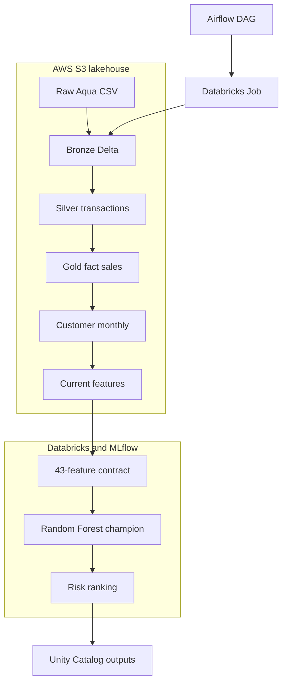
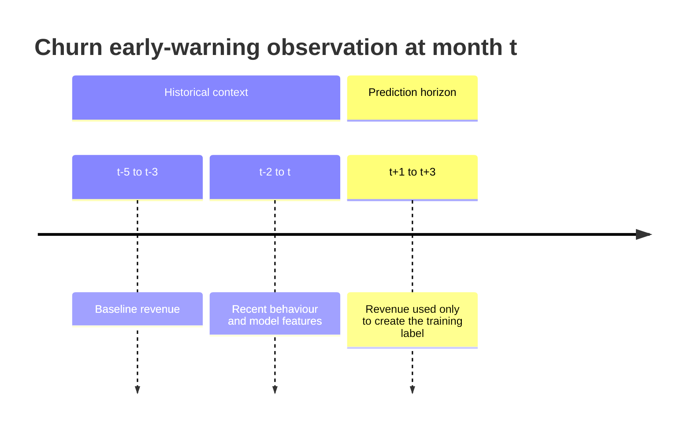
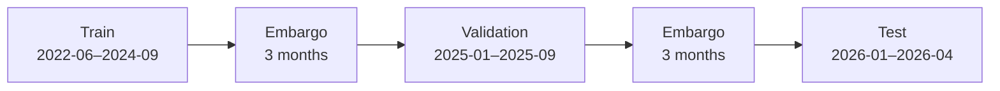
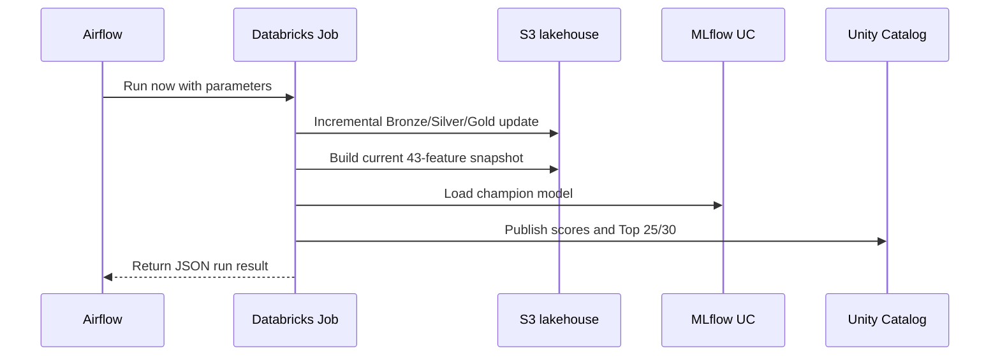

# Architecture and production design

## System objective

The platform converts quarterly commercial exports into an actionable ranking of customers who are currently eligible for intervention and are likely to suffer a revenue decline of at least 30% during the next three months.

## End-to-end topology

## Data contracts

### Bronze

- Incremental ingestion processes only files not previously recorded.
- Raw file contents and source metadata are retained.
- Re-running the same delivery does not duplicate data.

### Silver

- Raw Aqua rows are decoded and mapped to a typed transaction schema.
- Source provenance is preserved for reconciliation.
- Parser output is validated against the established Silver contract.

### Gold

- Commercial documents are consolidated into invoice-level facts.
- Only invoices affected by new files are rebuilt from complete Silver history.
- Delta merge semantics provide update/insert idempotency.
- Customer-month history supplies the time series used by target and feature generation.

## Target design

The model is trained only on information available at the snapshot. Future revenue is used exclusively to generate historical labels.

Eligibility requires sufficient history, a positive economic baseline, recent activity and no already-observed decline of 30% or more.

## Temporal validation controls

The three-month forward label creates a leakage risk near dataset boundaries. The project therefore uses chronological partitions separated by three-month embargoes.

Validation selects the model and operating policy. The test remains sealed until the champion configuration is frozen.

## Model contract

The Spark ML pipeline contains:

1. A `VectorAssembler` with 43 inputs in a fixed order.
2. A `RandomForestClassificationModel` with two output classes.

The scoring pipeline validates both the feature set and its order before inference. It rejects missing inputs, unexpected features, null values, duplicate customers, invalid probabilities and incomplete risk rankings.

## Production execution sequence

## Idempotency and failure behaviour

- Bronze file tracking prevents duplicate ingestion.
- Silver appends only newly parsed source files.
- Gold uses invoice-level merge logic.
- Serving outputs use deterministic overwrite plus recreated views.
- Airflow allows one active DAG run and Databricks allows the job to finish before the task succeeds.
- Contract failures raise errors before publication.
- Both Airflow and the Databricks API client apply bounded retries.

## Current deployment boundary

Databricks and S3 provide the persistent processing and serving layers. Airflow currently runs through Docker Compose on a local machine. This validates orchestration design, retries and observability, but it is not a continuously available production host.

For a permanent deployment, move the same DAG to a managed Airflow service or another always-on environment, use workload identity/OAuth where available, externalise workspace-specific IDs and enable centralised alerting.
